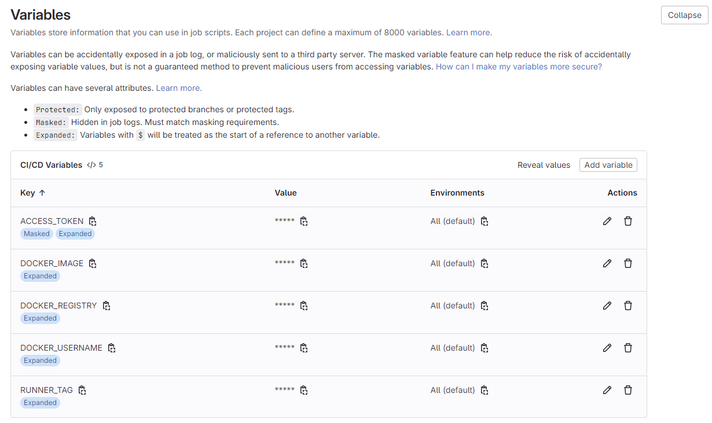

## Building a Docker Container Locally

To build your service container locally, use the `docker build` command.
> **Note:** Ensure you have Docker installed on your machine.

Alternatively, you can build your service container using GitLab’s CI/CD pipeline.
See the next section for more details.

---

## Setting up CI Pipeline on GitLab (Optional)

### 1. Create or Use an Existing GitLab Project

Create a new GitLab project or use an existing one.

   

### 2. Enable GitLab Runner

Navigate to **Project Settings → CI/CD → Runners** and enable a GitLab shell runner for the project.

### 3. Create Access Token for Docker Registry

Go to **Project Settings → Access Tokens**, and create an access token with read/write permissions to the Docker registry.

### 4. Set Up CI/CD Variables

Under **Project Settings → CI/CD → Variables**, add the following variables:

- **`ACCESS_TOKEN:`**
  Access token with read/write permissions to the container registry.

- **`DOCKER_USERNAME:`**
  Username for pushing and pulling Docker images.

- **`DOCKER_REGISTRY:`**
  Address of the Docker registry where images will be published.

- **`DOCKER_IMAGE:`**
  Address of the Docker registry and the name of the Docker image (without tags).

- **`RUNNER_TAG:`**
  Tag of the GitLab runner that will execute the jobs.

   

### 5. Push Service code to Repository

Push the contents of this repository to yours.

### 6. Pipeline Execution

The pipeline will automatically execute, building and publishing the Docker image to the specified registry.

### 7. Triggering the Pipeline

The pipeline will run on any code changes but can also be triggered manually via **Project → Deploy/Pipelines**.

## Setting up Deployment (CD Pipeline) on GitLab (Optional)

### 1. Create or Use an Existing GitLab Project

Follow the [steps for setting up a basic CI/CD pipeline](#setting-up-ci-pipeline-on-gitlab-(optional)) (steps 2, 3, and 4).

### 2. Configure GitLab Project Variables

Navigate to **Project Settings → CI/CD → Variables**, and add the following variables:

- **`KUBERNETES_CONFIG:`**
  Contains the Kubernetes configuration file used by `kubectl`, which holds information about clusters, users, and contexts.

- **`KUBERNETES_NAMESPACE:`**
  Specifies the name of the Kubernetes namespace where resources will be deployed. Ensure the namespace exists before deployment.

- **`KUBERNETES_SERVICE_NODEPORT:`**
  Defines the NodePort value for exposing a service on each node's IP at a static port. This allows external access to the service through the specified port, typically between `30000-32767`, enabling communication from outside the cluster.

- **`KUBERNETES_MANIFEST_LOCATION:`**
  Specifies the location of the Kubernetes manifests (YAML files) to be deployed.

   

### 3. Continue with CI Pipeline Setup

Proceed with the [remaining CI pipeline setup steps](#setting-up-ci-pipeline-on-gitlab-(optional)) (steps 5, 6, and 7).

### 4. Automatic Deployment Execution

Once the container is published, the deployment phase will automatically execute.